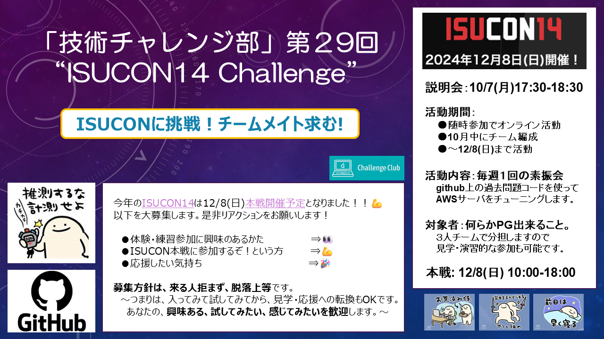

# ISUCONチャレンジ活動

## 登録チーム

- **チーム「しばいぬ」** 3名 
- **チーム「cc3」こと「mysqlgoリミットブレーカーズ」**  3名
- **チーム「cc4」**  3名

合計9名の参加者でエントリーしました！

**本戦：12月8日(日)開催！10:00-18:00**  

※本戦日の9:00頃からISUCON本戦YoutubeLiveがあるはず！  
　10:00以降は参加者はSNSでつぶやけませんのでYoutubeLiveを見ながら応援ください!!  

## 活動の様子（参加者の募集）

## 募集詳細
こんにちは！技術チャレンジ部、ISUCON14 Challenge 運営です。  
今年のISUCON14 は12/8(日)に本戦開催予定となりました！！参加メンバーを大募集します。   

**【説明会】** 10/7(月)17:30-18:30  (⇒**完了**しました。ありがとうございました！🎉)
- 体験・練習参加に興味のあるかた　　⇒👀　＃10/7説明会から
- ISUCON本戦に参加するぞ!という方　⇒💪　＃コンタクトください！
- 応援したい気持ち　　　　　　　　　⇒🎉　＃ありがとうございます！
 
**募集方針は、来る人拒まず、脱落上等**です。  
～つまりは、入ってみて試してみてから、見学・応援への転換もOKです。  
あなたの、**興味ある、試してみたい、感じてみたい**を歓迎します。～  

＃Linuxや何らかのプログラミング言語(Python,Nodejs,Go,Rust,Ruby等)が出来る必要がありますが３人組のチーム戦で分担しますので、見学・演習的な参加も可能です。現在３名ｘ４チームでエントリを検討中。お気軽にまずは相談ください。

## 活動の様子

活動の様子は下記のリンクを御覧ください。   
週１回火曜夜に90分程度の素振り会、木曜にもくもく会。  
火木とも各自自分の都合のいい時だけ参加。本戦当日含めオンラインで活動。  
使う言語は本戦までにチーム内で相談(去年はGoとRust/今年はGo)。 
- [攻略活動リポジトリ](https://github.com/ChallengeClub/isucon_tips/blob/main/README.md)
- [ISUCON攻略はじめの一歩 #AWS-Qiita](https://qiita.com/hide_take/items/b0c7aa4b854a1fa82fab)  
- [何もわからないけどISUCON13に挑戦してみた #ポエム-Qiita](https://qiita.com/kiwsdiv/items/597506988976702b97e2)  
- [秋の終わりまでにチャレンジしたことLT会](https://speakerdeck.com/hideakitakechi/isuconchu-can-jia-sitekita)
- [ISUCON公式Youtubeチャネル](https://www.youtube.com/@ISUCON_official)  
- [ISUCON13出題動画](https://www.youtube.com/watch?v=OOyInZbM85k)  

